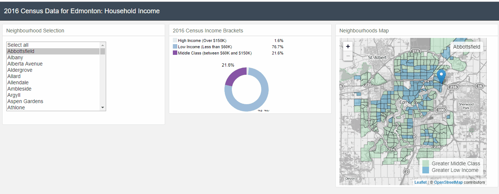

# Edmonton Census Insights by Neighbourhood

## Project Goals

* Look at the 2016 census data for Edmonton neighborhoods to try to glean insights into the economic distribution of YEG residents.
* Learn how to use d3 to create a dashboard for visualizing GIS data

## Discussion

I definitely learned a lot from this project in terms of how to code a spatial data visualization dashboard. However, as with any data visualization project, I had to learn about the data itself and make some assumptions. So first here are the map "goals"

* does a neighbourhood have a larger percentage of low income households or a larger percentage of middle class households
* what is the distribution for each neighbourhood of low income, middle class, and high income households

The first major assumption made in preparing the data for visualization was what categorizes a household as either "low income", "middle class", or "high income". To be considered middle class it seems like you need to make above the median income for your area [1](https://www.macleans.ca/economy/money-economy/are-you-in-the-middle-class/). In Edmonton that equates to an income of $70,080 (before tax) or $61,330 (after tax)[2](https://www150.statcan.gc.ca/t1/tbl1/en/tv.action?pid=1110001501&pickMembers%5B0%5D=1.35). A better and more detailed analyses is by using the [Low Income Measure After Tax](https://www150.statcan.gc.ca/n1/pub/75f0002m/75f0002m2018002-eng.htm). However the census data source I am using for this basic project doesn't include enough data to calculate the LIM-AT. So for this project the $60K is the entry point into the "middle class" category. That is based on the income categories available in the data source.

The upper range of middle class is less well defined. Looking at the household income for all of Edmonton we can see the following breakdown of values

* Less than $30K (16.1%)
* Less than $60K (40.9%)
* Less than $100K (66.7%)
* Less than $125K (78.7%)
* Less than $150K (86.3%)
* Less than $200K (93.7%)
* Less than $250K (96.8%)
* More than $250K (3.8%)

For the purpose of this project the "high income" is meant to show the top 20% of the households by income which equates to the $150K break point.

## Code Features and Improvements

### Neighbourhood Selection Option

- [x] use dc.selectionMenue to select a neighbourhood to highlight
- [ ] remove the default "select all" option since that doesn't make sense with this type of data

### Pie Chart showing the breakdown of Household income brackets

- [x] show the percentage of households in each income bracket
- [x] mouseover shows the bracket and percentage
- [x] format the values in the legend and mouseover to show percentage instead of the decimal format the data is saved as
- [x] format the income bracket name. The "easy" way would be to change it in the .csv file (this is the approach I ended up going with)... but I am interested in seeing if I can figure out how to do it via code. If this was python I would use a dictionary

### Map of Edmonton Neighborhoods

- [x] display a clickable, zoomable, draggable map using OpenStreetMap
- [x] color the neighbourhoods based on whether there are more "low income" households or "middle class" households in that neighbourhood.
- [x] on click display a popup with the neighbourhood name and the boolean integer value for >low income (1) or >middle class (0)
- [x] create a custom legend so it tells you which color is  >low income VS >middle class.

## Sources

The census data comes from the city of Edmonton open data portal

[YEG 2016 Census by household income](https://data.edmonton.ca/Census/2016-Census-Population-by-Household-Income-Neighbo/jkjx-2hix)

<!--[YEG 2016 Census Population by Age Range](https://data.edmonton.ca/Census/2016-Census-Population-by-Age-Range-Neighbourhood-/phd4-y42v)-->

[YEG neighbourhood boundaries](https://data.edmonton.ca/Geospatial-Boundaries/City-of-Edmonton-Neighbourhood-Boundaries/jfvj-x253)

[1: Are you in the Middle Class?](https://www.macleans.ca/economy/money-economy/are-you-in-the-middle-class/)

[2: Before-tax and after-tax low income status (census family LIM) by family type and family composition](https://www150.statcan.gc.ca/t1/tbl1/en/tv.action?pid=1110001501&pickMembers%5B0%5D=1.35)

[Low Income Measure After Tax](https://www150.statcan.gc.ca/n1/pub/75f0002m/75f0002m2018002-eng.htm)

## Acknowlegdments

I've been wanting to do a project like this for awhile but wasn't sure where to start until I came across [Mikel Otis ByLaw Infractions Dashboard I](https://github.com/Edmonton-Open-Data/Edmonton-Bylaw-Infractions-I/blob/master/README.md#bylaw-infractions-dashboard-i). I ran into Michael Otis at Startup Edmonton and saw some his dashboards online where he has been playing around with some of Edmonton's Open Data. I stole heavily from his code/work as a starting point to figure this all out since I don't know JS. I'm pretty much a python guy! If you want to check out some of Mikel's other stuff then head over to his github page. [Michael Otis PortFolio](https://mikelotis.github.io)
